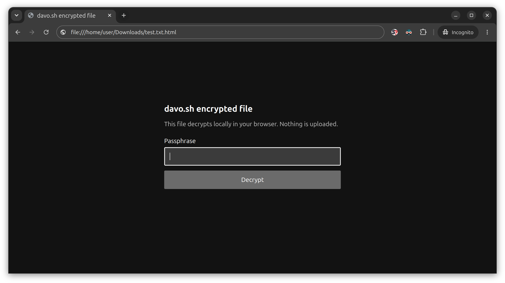

# davo.sh

Discord filesharing sucks, I don't have dropbox and I don't trust _any_ of these ppl anyways.

davo.sh is a slim little file-transfer tool for exactly that situation and reason. No account, no recipient-side installation, and no need to hand somebody a crypto tutorial before sending them a file.

```bash
./davo.sh photo.jpg
```

The file is encrypted locally before upload. davo.sh gives you a link and a passphrase; the recipient can decrypt the file in their browser without installing anything.

The plaintext and passphrase are never uploaded.

## Requirements

### Linux / macOS

- `bash`
- `curl`
- `gpg`
- `openssl`
- `zip`

### Windows

- PowerShell 5.1+
- GnuPG

[Gpg4win](https://gpg4win.org/) includes GnuPG. With `winget`:

```powershell
winget install --id GnuPG.GnuPG --exact
```

Use the standalone `davo.cmd`. It does not require a separate script or a PowerShell execution-policy change.

## Usage

```bash
./davo.sh photo.jpg
./davo.sh folder/
./davo.sh get 'https://...'
./davo.sh encrypt photo.jpg
./davo.sh decrypt photo.jpg.gpg
```

`send` is the default operation, so `davo.sh photo.jpg` is equivalent to `davo.sh send photo.jpg`. The explicit `send` form remains accepted. The same applies to Windows: `davo.cmd photo.jpg` is equivalent to `davo.cmd send photo.jpg`.

`get` accepts both davo.sh HTML links and raw encrypted links.

`encrypt` and `decrypt` are thin GnuPG wrappers.

Use `--no-html` to upload raw encrypted OpenPGP instead of generating the browser decryptor.

Uploads expire after 1 hour by default. Use `--expiry 24h` (or `-e 24h`) to change the expiry. BobaShare allows up to 30 days; qurl.sh allows up to 7 days.

## Backends

BobaShare is the default backend. `auto` tries BobaShare first and falls back to qurl.sh.

```bash
./davo.sh photo.jpg --backend bobashare
./davo.sh photo.jpg --backend qurl
```

BobaShare supports uploads up to 1 GiB and expiries up to 30 days. qurl.sh supports uploads up to 500 MiB and expiries up to 7 days.

## Archives

Directories are zipped before encryption. Regular files are only zipped when they are larger than 10 MiB.

## Passwords

Passphrases are visible while typing. Generated passwords are normally three Diceware words from the EFF 7776-word list, with a 32-character random hexadecimal fallback.

## Encryption

OpenPGP encryption uses AES-256 with iterated+salted SHA-256 S2K. Compression is disabled.

The browser decryptor embeds OpenPGP.js 6.3.1.


